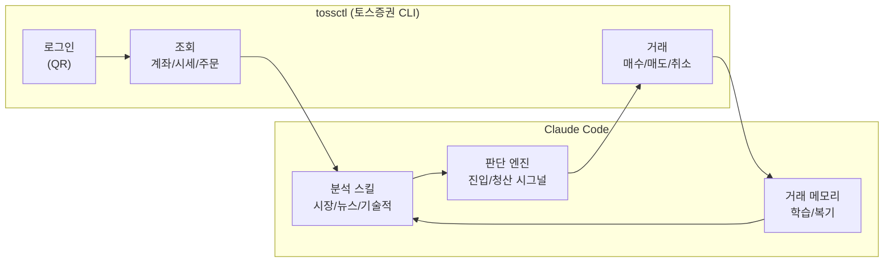
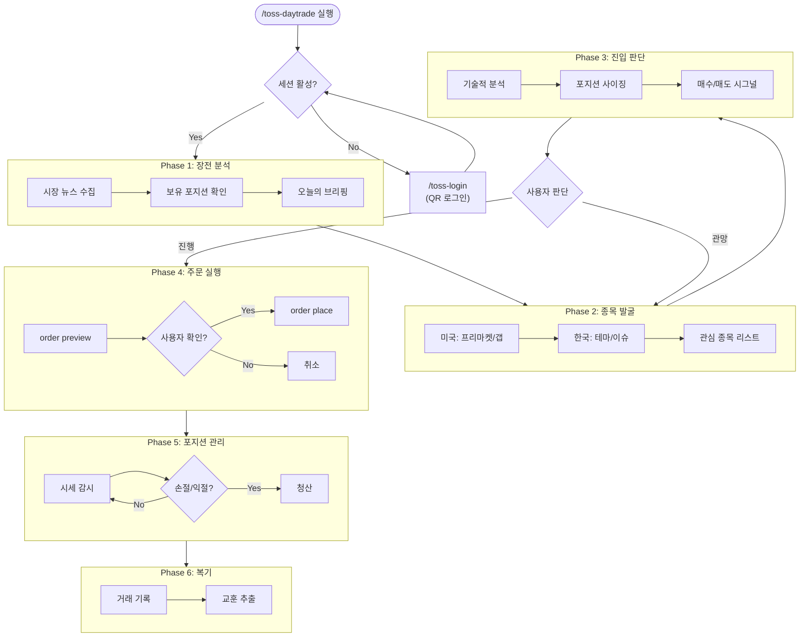
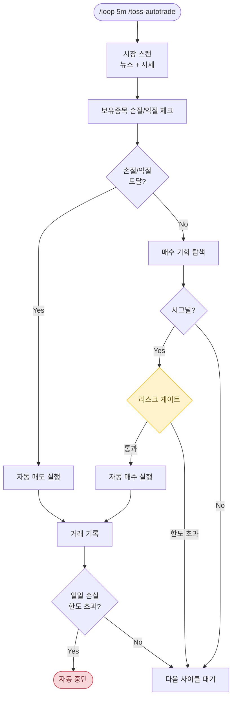

# toss-trading-system

Claude Code + 토스증권 CLI를 활용한 AI 기반 단타 트레이딩 시스템

> **비공식 프로젝트입니다.** 토스증권 웹 내부 API를 사용하며, 이용약관 위반 가능성이 있습니다.
> 모든 거래는 본인의 판단과 책임 하에 이루어집니다.

## 시스템 구조



## 사용 가능한 스킬

### 실행 스킬 (토스증권 연동)

| 스킬 | 명령어 | 설명 |
|------|--------|------|
| 로그인 | `/toss-login` | QR 로그인, 세션 관리 |
| 포트폴리오 | `/toss-portfolio` | 계좌 요약, 보유종목, 주문 내역 |
| 시세 | `/toss-quote` | 실시간 시세 조회 (미국/한국) |
| 주문 | `/toss-order` | 매수/매도/취소 (6단계 안전장치) |
| 내보내기 | `/toss-export` | CSV 내보내기 |
| **단타 통합** | **`/toss-daytrade`** | **분석→발굴→주문→복기 전체 워크플로우** |
| **자율 매매** | **`/toss-autotrade`** | **사용자 확인 없이 자동 분석/판단/실행** |
| **보호 종목** | **`/toss-protect`** | **특정 종목을 자동매매 대상에서 제외** |

### 보호 종목 가드레일

사용자가 직접 관리하는 종목은 AI가 절대 건드릴 수 없도록 **시스템 레벨에서 강제**합니다.

- `protected-stocks.json`에 보호 종목 등록
- Claude Code **PreToolUse hook**으로 `tossctl order place/cancel/amend` 실행 전 자동 차단
- 스킬 프롬프트와 무관하게 **시스템적으로 차단** (우회 불가)
- `/toss-protect`로 보호 종목 추가/제거/조회

```
보호 종목에 대한 주문 시도 →
  hook이 stdin JSON에서 --symbol 추출 →
    protected-stocks.json과 대조 →
      매치 시 exit 2 (차단) + stderr 메시지
```

### 분석 스킬 (claude-trading-skills 연동)

별도 설치 필요. [tradermonty/claude-trading-skills](https://github.com/tradermonty/claude-trading-skills) 참고.

| 스킬 | 설명 |
|------|------|
| `/market-news-analyst` | 시장 뉴스 임팩트 분석 |
| `/market-environment-analysis` | 글로벌 시장 환경 평가 |
| `/market-breadth-analyzer` | 시장 건강도 (0-100) |
| `/technical-analyst` | 차트 기술적 분석 |
| `/us-stock-analysis` | 미국 개별종목 심층 분석 |
| `/finviz-screener` | 종목 스크리닝 |
| `/vcp-screener` | VCP 패턴 발굴 |
| `/pead-screener` | 실적 모멘텀 종목 |
| `/position-sizer` | 포지션 사이징 계산 |
| `/trader-memory-core` | 거래 이력 추적 |

## 단타 워크플로우



## 자율 트레이딩 모드 (`/toss-autotrade`)

사용자 확인 없이 Claude가 자동으로 분석/판단/실행하는 모드입니다.



| 비교 | `/toss-daytrade` | `/toss-autotrade` |
|------|-------------------|-------------------|
| 사용자 확인 | 매 주문마다 필요 | 불필요 (자동) |
| 리스크 한도 | 자산 20% / 손절 -5% | 자산 10% / 손절 -3% (더 보수적) |
| 적합한 상황 | 직접 판단하며 거래 | 장시간 자동 운영 |
| `/loop` 연동 | 선택 | 필수 |

## 리스크 관리

| 규칙 | 값 |
|------|---|
| 1회 최대 투자 | 총 자산의 20% |
| 손절선 | 진입가 -3% ~ -5% |
| 익절선 | 진입가 +5% ~ +10% |
| 일일 최대 손실 | 총 자산의 -3% |
| 동시 포지션 | 최대 3종목 |

## 설치

### 요구사항

- macOS (Apple Silicon / Intel)
- [Claude Code](https://claude.ai/code)
- Go 1.25+
- Python 3.10+
- Google Chrome

### 원클릭 설치

```bash
git clone https://github.com/Aiden-Kwak/toss-trading-system.git
cd toss-trading-system
./install.sh
```

### 수동 설치

```bash
# 1. tossinvest-cli 빌드
git clone https://github.com/JungHoonGhae/tossinvest-cli.git
cd tossinvest-cli && make build

# 2. auth-helper 설치
cd auth-helper && python3 -m venv .venv
source .venv/bin/activate && pip install -e .
playwright install chromium

# 3. 스킬 복사
cp -r skills/toss-* ~/.claude/skills/

# 4. 환경변수 (.zshrc에 추가)
export PATH="<path-to>/tossinvest-cli/bin:$PATH"
export TOSSCTL_AUTH_HELPER_DIR="<path-to>/tossinvest-cli/auth-helper"
export TOSSCTL_AUTH_HELPER_PYTHON="<path-to>/tossinvest-cli/auth-helper/.venv/bin/python3"

# 5. 로그인
tossctl auth login
```

## 거래 가능 시간

| 시장 | 거래 시간 (한국시간) |
|------|---------------------|
| 한국 (KOSPI/KOSDAQ) | 09:00 - 15:30 |
| 미국 (NYSE/NASDAQ) | 23:30 - 06:00 (서머타임: 22:30 - 05:00) |

## 참고

- [tossinvest-cli](https://github.com/JungHoonGhae/tossinvest-cli) - 토스증권 비공식 CLI
- [claude-trading-skills](https://github.com/tradermonty/claude-trading-skills) - Claude Code 트레이딩 분석 스킬 50개

## License

MIT
