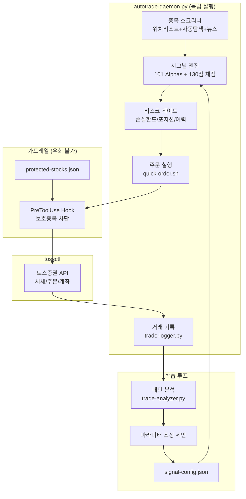

# toss-trading-system

AI 기반 단타 트레이딩 시스템 — 토스증권 CLI + 시그널 엔진 + 자동매매 데몬

> **비공식 프로젝트입니다.** 토스증권 웹 내부 API를 사용하며, 이용약관 위반 가능성이 있습니다.
> 모든 거래는 본인의 판단과 책임 하에 이루어집니다.

## 시스템 구조



## 핵심 컴포넌트

### 자동매매 데몬 (Claude 불필요)

```bash
# 시뮬레이션 (주문 안 함)
python3 scripts/autotrade-daemon.py --dry-run

# 실거래 (5분 간격, 미국주식)
python3 scripts/autotrade-daemon.py --interval 300 --market us

# 터미널 닫아도 계속 실행
caffeinate -i python3 scripts/autotrade-daemon.py --interval 300 &
```

```
매 사이클:
  1. 세션 체크 ─── 만료 → macOS 알림 → 재로그인 대기
  2. 점검 체크 ─── 점검 → 자동 대기 → 재개
  3. 장 시간 ───── 휴장 → 스킵
  4. 일일 손실 ─── 한도 → 거래 중단
  5. 연속 손절 ─── 3회 → 30분 냉각 → 재개
  6. 포지션 체크 ─ 손절/익절 → 자동 매도
  7. 리스크 게이트 ─ 미통과 → 매수 스킵
  8. 스크리너 ──── 워치리스트 채점 → A/B만 매수
  9. 주문 실행 ─── 실패 → 에러 로그 + 재시도
```

### 시그널 엔진 (`signal-engine.py`)

| 기능 | 명령 | 설명 |
|------|------|------|
| 손절/익절 | `check-positions` | ≤-3% 손절, ≥+7% 익절, ≤-5% 급락 경고 |
| 매수 채점 | `evaluate-buy` | 130점 (거래량+모멘텀+가격+여력+알파) |
| 리스크 게이트 | `risk-gate` | 일일손실/포지션/여력 3개 체크 |
| 알파 계산 | `compute-alphas` | 101 Formulaic Alphas 5개 |

#### 101 Formulaic Alphas ([Kakushadze, 2016](https://arxiv.org/abs/1601.00991))

| 알파 | 공식 | 의미 |
|------|------|------|
| Alpha#101 | `(close-open)/(high-low)` | 장중 방향 강도 |
| Alpha#33 | `1-(open/close)` | 시가-종가 괴리율 |
| Alpha#54 | `(close-low)/(high-low)` | 장중 가격 위치 |
| Mean Reversion | `-ln(open/ref_close)` | 갭 반등/되돌림 |
| Momentum | `ln(close/ref_close)` | 추세 지속 방향 |

#### 한국/미국 분리 채점

| 항목 | 한국 | 미국 |
|------|------|------|
| 거래량 30점 | 500만주+→30 | 5000만주+→30 |
| 모멘텀 25점 | +8~15%→20 (정상) | +5~10%→15 |
| 가격위치 25점 | ±3% 보합 | ±2% 보합 |

### 종목 스크리너 (`stock-screener.py`)

3개 소스를 통합하여 매수 후보를 발굴합니다.

```
📋 워치리스트    →  사용자 등록 종목, tossctl 시세 조회
🔍 자동 탐색    →  yfinance로 거래량 급증/갭 탐색 (US 37 + KR 20종목)
📰 뉴스 종목    →  직접 입력한 심볼 즉시 평가

→ signal-engine 채점 → A/B(매수) / C(관망) / D(스킵)
```

### 거래 기록 & 학습 루프

```
거래 실행 → trade-logger (자동 기록, 태깅)
    → trade-analyzer (패턴 분석: 등급별/시장별/요일별)
        → 파라미터 조정 제안 (대시보드에서 체크 & 반영)
            → signal-config.json 업데이트
                → 다음 거래에 반영
```

### 백테스트 (`backtest.py`)

```bash
# 여러 종목 비교 (미래참조 없음, 수수료 포함, B&H 벤치마크)
python3 scripts/backtest.py --symbol PLTR,IREN,005930.KS --period 6mo

# 파라미터 조정 테스트
python3 scripts/backtest.py --symbol PLTR --stop-loss -0.05 --take-profit 0.10 --grades A
```

### 보호 종목 가드레일

```
보호 종목 주문 시도 → PreToolUse hook → exit 2 차단 (우회 불가)
```

- 시스템 레벨 강제 (Claude/데몬 모두 차단)
- `protected-stocks.json`으로 관리
- `/toss-protect`로 추가/제거

## 웹 대시보드

```bash
python3 dashboard/server.py  # → http://localhost:8777
```

| 탭 | 내용 |
|---|---|
| **대시보드** | 파이프라인, 계좌, 보유종목, 시그널, 데몬 상태 |
| **스크리너** | 워치리스트, 자동탐색, 뉴스, 매수평가(101 Alphas) |
| **리스크** | 게이트, 파라미터 조정 제안, 보호종목 |
| **기록** | 거래기록 & 교훈, 패턴분석 |

## Claude Code 스킬

Claude Code에서 직접 호출 가능한 스킬:

| 스킬 | 설명 |
|------|------|
| `/toss-login` | QR 로그인, 세션 관리 |
| `/toss-portfolio` | 계좌/포트폴리오 조회 |
| `/toss-quote` | 실시간 시세 조회 |
| `/toss-order` | 매수/매도/취소 (사용자 확인) |
| `/toss-daytrade` | 분석→발굴→주문→복기 (사용자 확인 모드) |
| `/toss-autotrade` | 자율 트레이딩 (/loop 연동) |
| `/toss-protect` | 보호 종목 관리 |
| `/toss-export` | CSV 내보내기 |
| `/toss-dashboard` | 대시보드 실행 |

## 리스크 관리

| 규칙 | autotrade-daemon | /toss-daytrade |
|------|-------------------|----------------|
| 1회 최대 투자 | 총 자산 10% | 총 자산 20% |
| 손절선 | -3% | -3% ~ -5% |
| 익절선 | +7% | +5% ~ +10% |
| 일일 최대 손실 | -2% (자동 중단) | -3% |
| 동시 포지션 | 2종목 | 3종목 |
| 연속 손절 냉각 | 3회 → 30분 | 없음 |
| 세션 만료 시 | 알림 + 매수 중단 | 안내 |

## 설치

### 요구사항

- macOS (Apple Silicon / Intel)
- Go 1.25+ / Python 3.10+ / Google Chrome
- [Claude Code](https://claude.ai/code) (스킬 사용 시)

### 원클릭 설치

```bash
git clone https://github.com/Aiden-Kwak/toss-trading-system.git
cd toss-trading-system
./install.sh
```

### 수동 설치

```bash
# 1. tossinvest-cli 빌드
git clone https://github.com/JungHoonGhae/tossinvest-cli.git
cd tossinvest-cli && make build

# 2. auth-helper 설치
cd auth-helper && python3 -m venv .venv
source .venv/bin/activate && pip install -e .
playwright install chromium

# 3. 스킬 복사
cp -r skills/toss-* ~/.claude/skills/

# 4. 환경변수 (.zshrc)
export PATH="<path>/tossinvest-cli/bin:$PATH"
export TOSSCTL_AUTH_HELPER_DIR="<path>/tossinvest-cli/auth-helper"
export TOSSCTL_AUTH_HELPER_PYTHON="<path>/tossinvest-cli/auth-helper/.venv/bin/python3"

# 5. 로그인
tossctl auth login
```

## 참고

- [tossinvest-cli](https://github.com/JungHoonGhae/tossinvest-cli) — 토스증권 비공식 CLI
- [claude-trading-skills](https://github.com/tradermonty/claude-trading-skills) — Claude Code 트레이딩 분석 스킬 50개
- [101 Formulaic Alphas](https://arxiv.org/abs/1601.00991) — Kakushadze (2016), 시그널 엔진 알파 공식 출처

## License

MIT
