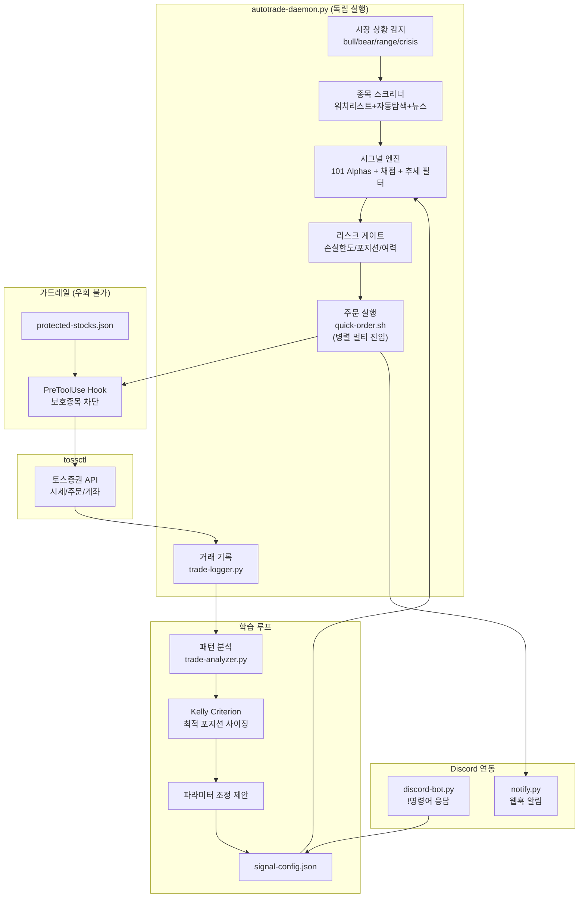

# toss-trading-system

AI 기반 단타 트레이딩 시스템 — 토스증권 CLI + 시그널 엔진 + 자동매매 데몬

> **비공식 프로젝트입니다.** 토스증권 웹 내부 API를 사용하며, 이용약관 위반 가능성이 있습니다.
> 모든 거래는 본인의 판단과 책임 하에 이루어집니다.

## 시스템 구조



## 핵심 컴포넌트

### 자동매매 데몬 (Claude 불필요)

```bash
# 시뮬레이션 (주문 안 함)
python3 scripts/autotrade-daemon.py --dry-run

# 실거래 (5분 간격, 미국주식)
python3 scripts/autotrade-daemon.py --interval 300 --market us

# 터미널 닫아도 계속 실행
caffeinate -i python3 scripts/autotrade-daemon.py --interval 300 &
```

```
매 사이클:
  1. 세션 체크 ─── 만료 → Discord 알림 → 재로그인 대기
  2. 점검 체크 ─── 점검 → Discord 알림 → 자동 대기 → 재개
  3. 장 시간 ───── 휴장 → 스킵 (마감 시 일일 보고서 자동 전송)
  4. 일일 손실 ─── 한도(운용금 기준) → Discord 알림 → 거래 중단
  5. 연속 손절 ─── 3회 → Discord 알림 → 30분 냉각 → 재개
  6. 포지션 체크 ─ 시그널 알림 → 손절/익절/트레일링 → 자동 매도 → 알림
  7. 리스크 게이트 ─ 미통과 → 매수 스킵
  8. 스크리너 ──── 워치리스트 채점 → A/B만 매수
  9. 멀티 진입 ─── 포지션 한도까지 병렬 매수 → 알림 (주문가능금액 균등 배분)
```

### 시그널 엔진 (`signal-engine.py`)

| 기능 | 명령 | 설명 |
|------|------|------|
| 손절/익절 | `check-positions` | 손절(-3%), 익절(+7%), 트레일링 스톱, 급락 경고 |
| 매수 채점 | `evaluate-buy` | 130점 + 시장 보정 + 추세 필터 |
| 리스크 게이트 | `risk-gate` | 일일손실/포지션/여력 (운용금 기준) |
| 알파 계산 | `compute-alphas` | 101 Formulaic Alphas 5개 |
| Kelly 계산 | `kelly` | 승률 기반 최적 포지션 사이징 |
| 시장 감지 | `regime` | bull/bear/range/crisis 판별 |

#### 매수 채점 체계

```
거래량     (30점)  KR/US 분리 기준
모멘텀     (25점)  KR/US 분리 기준 (한국 ±30% 가격제한 반영)
가격위치   (25점)  KR/US 분리 기준
포트폴리오 (20점)  주문가능금액 기준 (총자산 아님)
알파       (30점)  101 Formulaic Alphas 복합 점수
시장 보정  (±15)   bull +5 / bear -10 / crisis -15
추세 필터  (-5)    하락추세 내 반등 매수 시 감점 (falling knife 방지)
────────────────
A(70%+) STRONG_BUY | B(55%+) BUY | C(40%+) WATCH | D(<40%) SKIP
```

#### 101 Formulaic Alphas ([Kakushadze, 2016](https://arxiv.org/abs/1601.00991))

| 알파 | 공식 | 의미 |
|------|------|------|
| Alpha#101 | `(close-open)/(high-low)` | 장중 방향 강도 |
| Alpha#33 | `1-(open/close)` | 시가-종가 괴리율 |
| Alpha#54 | `(close-low)/(high-low)` | 장중 가격 위치 |
| Mean Reversion | `-ln(open/ref_close)` | 갭 반등/되돌림 |
| Momentum | `ln(close/ref_close)` | 추세 지속 방향 |

#### 트레일링 스톱

```
기존: 고정 익절선(+7%)에만 도달해야 청산
추가: 수익 +3% 이상 후 당일 -2% 하락 → 트레일링 스톱 발동 → 수익 보호
```

#### Kelly Criterion

```bash
python3 scripts/signal-engine.py kelly --win-rate 0.5 --avg-win 5 --avg-loss 3
→ Half Kelly: 10.0% (max_position_pct 권장)
```

### 종목 스크리너 (`stock-screener.py`)

```
📋 워치리스트    →  사용자 등록 종목, tossctl 시세 조회
🔍 자동 탐색    →  yfinance로 거래량 급증/갭 탐색 (US 37 + KR 20종목)
📰 뉴스 종목    →  직접 입력한 심볼 즉시 평가

→ signal-engine 채점 → A/B(매수) / C(관망) / D(스킵)
```

**A등급이 여러 개일 때 매수 우선순위:**

| 순위 | 기준 | 이유 |
|------|------|------|
| 1차 | 등급 (A > B) | 강한 시그널 우선 |
| 2차 | 점수 높은 순 | 같은 등급 내 정밀 비교 |
| 3차 | 거래량 급증 비율 | 유동성 높아야 체결 확실 |
| 4차 | 과거 손실 적은 순 | 반복 손실 종목 자동 후순위 |

워치리스트 추가 시 **심볼 유효성 자동 검증** (tossctl → yfinance 폴백).
한국 종목코드는 **토스증권 public API**로 코스피/코스닥 자동 판별.

### 거래 기록 & 학습 루프

```
거래 실행 → trade-logger (자동 기록 + 자동 교훈 생성)
    → trade-analyzer (패턴 분석: 등급별/시장별/요일별/태그별)
        → 20사이클마다 자동 분석 + 파라미터 자동 적용
            → 10건+: 손절선/익절선/등급 자동 조정
            → 20건+: Kelly Criterion으로 포지션 사이징 자동 최적화
                → signal-config.json 즉시 반영 → 다음 거래에 적용
```

**자동 교훈 생성**: 청산 시 exit_reason 기반으로 교훈 자동 작성 (손절 → "진입 타이밍 검토", 익절 → "판단 적절" 등).
**과거 손실 반영**: 반복 손실된 종목은 스크리너에서 자동으로 후순위.

### 백테스트

```bash
# 기간 백테스트 (미래참조 없음, T+1 시가 매수, 수수료 포함, B&H 벤치마크)
python3 scripts/backtest.py --symbol PLTR,005930.KS --period 6mo

# 하루 시뮬레이션 (5분봉, 2단계 채점: 장시작 스크리닝 → 5분마다 평가)
python3 scripts/day-simulator.py --symbols TSLA,NVDA --date 2026-04-10
```

### 보호 종목 가드레일

```
보호 종목 주문 시도 → PreToolUse hook → exit 2 차단 (우회 불가)
```

- 시스템 레벨 강제 (Claude/데몬 모두 차단)
- `protected-stocks.json`으로 관리
- 일일 손실 계산에서 보호종목 등락 제외

## 웹 대시보드

```bash
python3 dashboard/server.py  # → http://localhost:8777
```

| 탭 | 내용 |
|---|---|
| **대시보드** | AI 파이프라인 (클릭 시 세부 로그), 계좌, 보유종목, 시그널, 데몬 제어 (Dry Run / Go Live / 중지) |
| **스크리너** | 워치리스트, 자동탐색, 뉴스, 기술적 분석 (RSI/BB/EMA), 실시간 랭킹, 매수평가 |
| **백테스트** | 기간 백테스트 (자동 전략 분기), 포트폴리오 백테스트 (다종목 병렬), 하루 시뮬레이션 |
| **리스크** | 트레이딩 설정 편집, 게이트, 파라미터 조정 제안, 보호종목 |
| **기록** | 거래기록 & 교훈, 패턴분석, 보고서 (일일/주간/월간 + PDF 다운로드) |

### 데몬 제어

| 버튼 | 동작 |
|------|------|
| **Dry Run** | 주문 없이 시그널만 기록 (검증용) |
| **Go Live** | 실제 주문 실행 (확인 대화상자) |
| **중지** | 실행 중인 데몬 종료 |

### 보고서

| 유형 | 기간 | PDF |
|------|------|-----|
| 일일 | 당일 | 다운로드 가능 |
| 주간 | 최근 7일 | 다운로드 가능 |
| 월간 | 최근 30일 | 다운로드 가능 |

## Discord 연동

### 초기 설정

#### 1. Discord Bot 생성

1. [Discord Developer Portal](https://discord.com/developers/applications) 접속
2. **New Application** → 이름 입력 → Create
3. 왼쪽 **Bot** 메뉴 → **Reset Token** → 토큰 복사 (한 번만 표시됨)
4. 같은 페이지 **Privileged Gateway Intents** 에서 3개 모두 ON:
   - `PRESENCE INTENT` / `SERVER MEMBERS INTENT` / `MESSAGE CONTENT INTENT`
5. **Save Changes**

#### 2. Bot을 서버에 초대

1. 왼쪽 **OAuth2** → **URL Generator**
2. SCOPES: `bot` 체크
3. BOT PERMISSIONS: `Send Messages`, `Read Message History`, `Read Messages/View Channels` 체크
4. 생성된 URL을 브라우저에 붙여넣기 → 서버 선택 → 승인

#### 3. 환경변수 설정

```bash
# 프로젝트 루트에 .env 파일 생성
cat > .env << 'EOF'
DISCORD_BOT_TOKEN=<위에서 복사한 봇 토큰>
DISCORD_WEBHOOK_URL=<Discord 채널 설정 → 연동 → 웹훅 URL>
EOF
```

#### 4. 의존성 설치 & 실행

```bash
# discord.py 설치 (프로젝트 venv에)
.venv/bin/pip install discord.py

# 봇 실행
.venv/bin/python3 scripts/discord-bot.py
```

### 봇 명령어 (`discord-bot.py`)

채널에서 명령어를 입력하면 거래 정보 조회, 데몬 제어, 종목 스크리닝이 가능합니다.

| 분류 | 명령어 | 설명 |
|------|--------|------|
| **조회** | `!positions` | 현재 보유 포지션 |
| | `!trades [N]` | 최근 N건 청산 내역 (기본 5) |
| | `!today` | 오늘 거래 요약 |
| | `!status` | 데몬 상태 (프로세스/사이클/손익) |
| | `!report` | 일일 보고서 생성 |
| | `!scan [watchlist\|auto\|all]` | 종목 스크리닝 (등급/점수) |
| **제어** | `!mode live\|dry-run` | 거래 모드 전환 |
| | `!daemon start\|stop` | 데몬 원격 시작/종료 |
| | `!login` | 토스증권 세션 갱신 시도 |
| **기타** | `!ping` | 봇 응답 테스트 |
| | `!help` | 명령어 목록 |

### Discord 알림 (`notify.py`)

데몬의 모든 이벤트가 Discord 웹훅으로 자동 전송됩니다.

| 이벤트 | 알림 내용 |
|--------|----------|
| 매수/매도 | 종목, 수량, 가격, 등급, P&L, 청산 사유 |
| 시그널 감지 | 손절/익절/트레일링/급락/추세파괴 |
| 상태 변경 | 실행/세션만료/점검/손실한도/냉각기/에러 |
| 장 마감 | 일일 보고서 자동 전송 |

모든 알림에 **LIVE / DRY RUN** 모드가 표시됩니다.

## 상시 실행 (launchd)

터미널 없이 Mac 부팅 시 자동 시작, 크래시 시 자동 재시작됩니다.

### 설정

```bash
# 1. 로그 디렉토리 생성
mkdir -p ~/Library/Logs/toss-trading

# 2. plist 파일 복사 (프로젝트에 포함)
cp launchd/com.toss-trading.discord-bot.plist ~/Library/LaunchAgents/
cp launchd/com.toss-trading.autotrade-daemon.plist ~/Library/LaunchAgents/

# 3. plist 내 경로를 본인 환경에 맞게 수정
#    - ProgramArguments의 python3 경로 (.venv/bin/python3)
#    - WorkingDirectory
#    - StandardOutPath / StandardErrorPath

# 4. 서비스 등록
launchctl load ~/Library/LaunchAgents/com.toss-trading.discord-bot.plist
launchctl load ~/Library/LaunchAgents/com.toss-trading.autotrade-daemon.plist
```

### 관리

```bash
# 상태 확인
launchctl list | grep toss-trading

# 서비스 해제
launchctl unload ~/Library/LaunchAgents/com.toss-trading.discord-bot.plist
launchctl unload ~/Library/LaunchAgents/com.toss-trading.autotrade-daemon.plist

# 로그 확인
tail -f ~/Library/Logs/toss-trading/discord-bot.log
tail -f ~/Library/Logs/toss-trading/autotrade-daemon.log
```

| 설정 | 내용 |
|------|------|
| `RunAtLoad` | 부팅 시 자동 시작 |
| `KeepAlive` | 크래시 시 자동 재시작 |
| `PYTHONUNBUFFERED=1` | 로그 실시간 출력 |

## Claude Code 스킬

| 스킬 | 설명 |
|------|------|
| `/toss-login` | QR 로그인, 세션 관리 |
| `/toss-portfolio` | 계좌/포트폴리오 조회 |
| `/toss-quote` | 실시간 시세 조회 |
| `/toss-order` | 매수/매도/취소 (사용자 확인) |
| `/toss-daytrade` | 분석→발굴→주문→복기 (사용자 확인 모드) |
| `/toss-autotrade` | 자율 트레이딩 (/loop 연동) |
| `/toss-protect` | 보호 종목 관리 |
| `/toss-export` | CSV 내보내기 |
| `/toss-dashboard` | 대시보드 실행 |
| `/toss-trading-brain` | 전략 지식 베이스 (전략 논의/파라미터 조정 시 자동 참조) |

## 리스크 관리

| 규칙 | autotrade-daemon | /toss-daytrade |
|------|-------------------|----------------|
| 포지션 사이징 | 주문가능금액 기준 (Kelly 권장) | 주문가능금액 20% |
| 멀티 진입 | 한도까지 병렬 (균등 배분) | 1종목씩 |
| 손절선 | -3% | -3% ~ -5% |
| 익절선 | +7% | +5% ~ +10% |
| 트레일링 스톱 | +3% 이후 당일 -2% | 없음 |
| 일일 최대 손실 | -2% (운용금 기준, 보호종목 제외) | -3% |
| 동시 포지션 | 2종목 (설정 가능) | 3종목 |
| 연속 손절 냉각 | 3회 → 30분 | 없음 |
| 시장 상황 보정 | bear -10점, crisis -15점 | 없음 |
| 추세 필터 | 하락추세 반등 매수 -5점 | 없음 |
| 세션 만료 시 | 알림 + 매수 중단 | 안내 |

## 설치

### 요구사항

- macOS (Apple Silicon / Intel)
- Go 1.25+ / Python 3.10+ / Google Chrome
- [Claude Code](https://claude.ai/code) (스킬 사용 시)

### 원클릭 설치

```bash
git clone https://github.com/Aiden-Kwak/toss-trading-system.git
cd toss-trading-system
./install.sh
```

### 수동 설치

```bash
# 1. tossinvest-cli 빌드
git clone https://github.com/JungHoonGhae/tossinvest-cli.git
cd tossinvest-cli && make build

# 2. auth-helper 설치
cd auth-helper && python3 -m venv .venv
source .venv/bin/activate && pip install -e .
playwright install chromium

# 3. Python 의존성
cd toss-trading-system && python3 -m venv .venv
source .venv/bin/activate && pip install yfinance pandas

# 4. 스킬 복사
cp -r skills/toss-* ~/.claude/skills/

# 5. 환경변수 (.zshrc)
export PATH="<path>/tossinvest-cli/bin:$PATH"
export TOSSCTL_AUTH_HELPER_DIR="<path>/tossinvest-cli/auth-helper"
export TOSSCTL_AUTH_HELPER_PYTHON="<path>/tossinvest-cli/auth-helper/.venv/bin/python3"

# 6. 로그인
tossctl auth login
```

## 참고

- [tossinvest-cli](https://github.com/JungHoonGhae/tossinvest-cli) — 토스증권 비공식 CLI
- [claude-trading-skills](https://github.com/tradermonty/claude-trading-skills) — Claude Code 트레이딩 분석 스킬 50개
- [101 Formulaic Alphas](https://arxiv.org/abs/1601.00991) — Kakushadze (2016)
- [Kelly Criterion](https://www.quantstart.com/articles/Money-Management-via-the-Kelly-Criterion/) — 포지션 사이징
- [Mean Reversion Strategies](https://www.quantifiedstrategies.com/mean-reversion-strategies/) — 평균회귀 전략

## License

MIT
