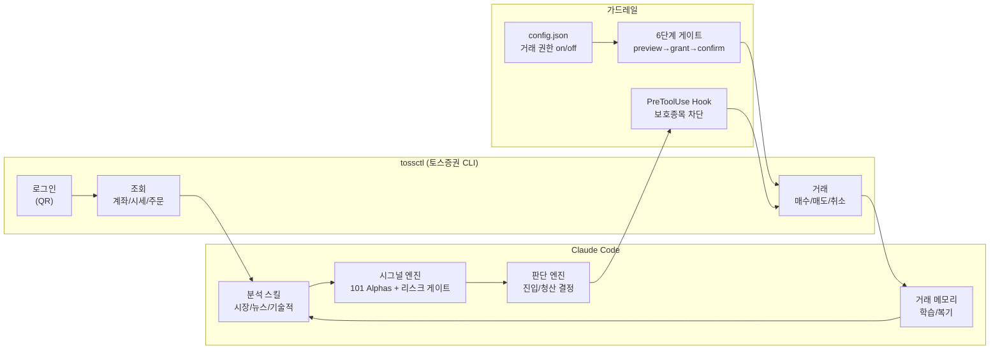
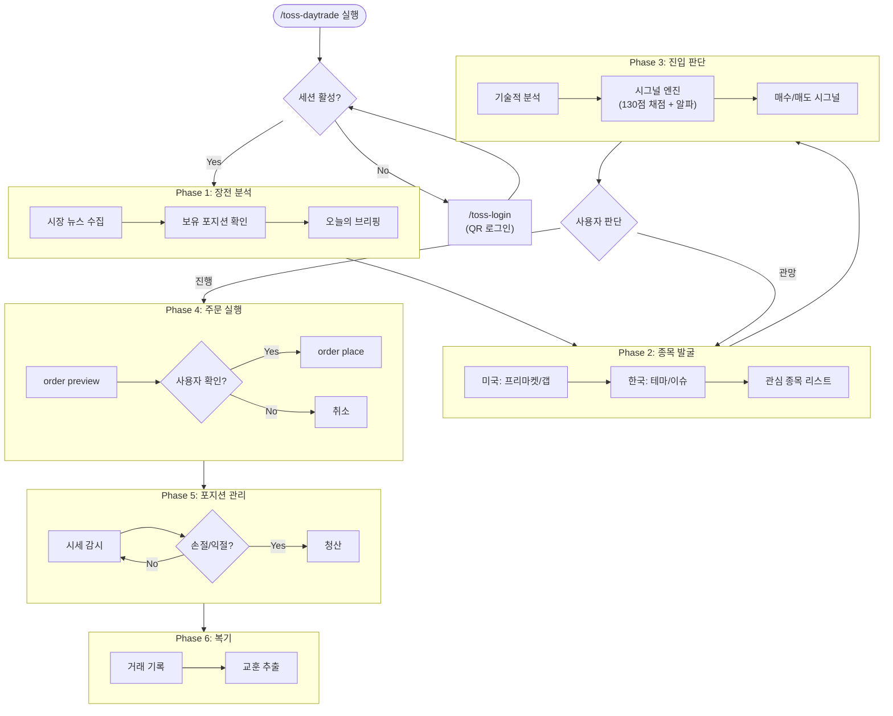
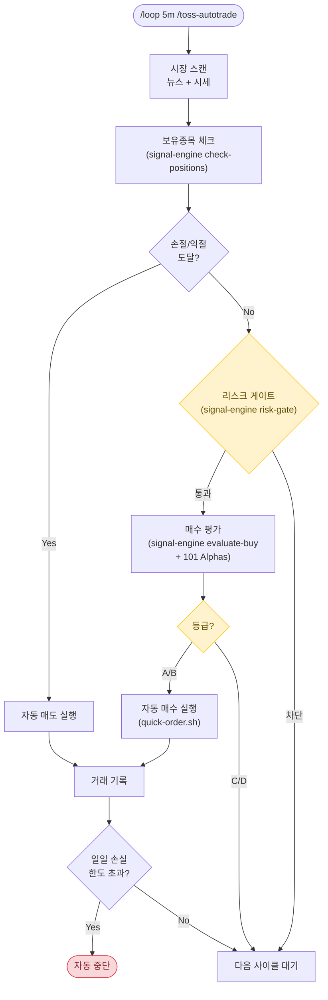
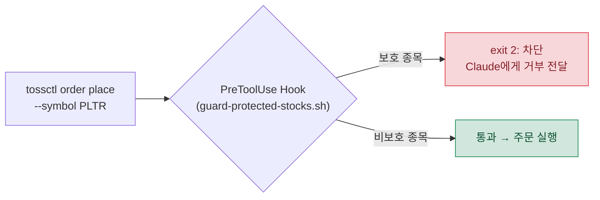

# toss-trading-system

Claude Code + 토스증권 CLI를 활용한 AI 기반 단타 트레이딩 시스템

> **비공식 프로젝트입니다.** 토스증권 웹 내부 API를 사용하며, 이용약관 위반 가능성이 있습니다.
> 모든 거래는 본인의 판단과 책임 하에 이루어집니다.

## 시스템 구조



## 사용 가능한 스킬

### 실행 스킬 (토스증권 연동)

| 스킬 | 명령어 | 설명 |
|------|--------|------|
| 로그인 | `/toss-login` | QR 로그인, 세션 관리 |
| 포트폴리오 | `/toss-portfolio` | 계좌 요약, 보유종목, 주문 내역 |
| 시세 | `/toss-quote` | 실시간 시세 조회 (미국/한국) |
| 주문 | `/toss-order` | 매수/매도/취소 (6단계 안전장치) |
| 내보내기 | `/toss-export` | CSV 내보내기 |
| **단타 통합** | **`/toss-daytrade`** | **분석→발굴→주문→복기 (사용자 확인 모드)** |
| **자율 매매** | **`/toss-autotrade`** | **사용자 확인 없이 자동 분석/판단/실행** |
| **보호 종목** | **`/toss-protect`** | **특정 종목을 자동매매 대상에서 제외** |

### 분석 스킬 (claude-trading-skills 연동)

별도 설치 필요. [tradermonty/claude-trading-skills](https://github.com/tradermonty/claude-trading-skills) 참고.

| 스킬 | 설명 |
|------|------|
| `/market-news-analyst` | 시장 뉴스 임팩트 분석 |
| `/market-environment-analysis` | 글로벌 시장 환경 평가 |
| `/market-breadth-analyzer` | 시장 건강도 (0-100) |
| `/technical-analyst` | 차트 기술적 분석 |
| `/us-stock-analysis` | 미국 개별종목 심층 분석 |
| `/finviz-screener` | 종목 스크리닝 |
| `/vcp-screener` | VCP 패턴 발굴 |
| `/pead-screener` | 실적 모멘텀 종목 |
| `/position-sizer` | 포지션 사이징 계산 |
| `/trader-memory-core` | 거래 이력 추적 |

## 시그널 엔진 (`signal-engine.py`)

정량적 판단을 코드로 강제하는 엔진입니다. Claude의 자연어 판단이 아닌 수치 기반 로직으로 일관성을 보장합니다.

### 매수 채점 (130점 만점)

```
evaluate-buy: 5개 항목으로 종목을 채점

거래량     (30점)  50M+→30  20M+→25  10M+→20  5M+→15
모멘텀     (25점)  +1~5%→25(적정)  +5~10%→15  +10%→5(과열)
가격위치   (25점)  전일比 -2~5%→25(저가매수)  ±2%→20  +5%↑→5
포트폴리오 (20점)  여력 충분→20  부족→10  없음→0
알파       (30점)  101 Formulaic Alphas 복합 점수 ← NEW
────────────────
A(70%+) STRONG_BUY | B(55%+) BUY | C(40%+) WATCH | D(<40%) SKIP
```

### 101 Formulaic Alphas

[Kakushadze (2016)](https://arxiv.org/abs/1601.00991) 논문에서 tossctl 데이터로 계산 가능한 5개 알파를 구현했습니다.

| 알파 | 공식 | 의미 |
|------|------|------|
| **Alpha#101** | `(close-open)/(high-low)` | 장중 방향 강도 (-1=강한 음봉 ~ +1=강한 양봉) |
| **Alpha#33** | `1-(open/close)` | 시가-종가 괴리율 (양수=장중 상승) |
| **Alpha#54** | `(close-low)/(high-low)` | 장중 가격 위치 (0=저가 마감 ~ 1=고가 마감) |
| **Mean Reversion** | `-ln(open/ref_close)` | 갭다운→반등 기대 / 갭업→되돌림 기대 |
| **Momentum** | `ln(close/ref_close)` | 추세 지속 방향 및 강도 |

```bash
# 알파 단독 계산
python3 scripts/signal-engine.py compute-alphas --quote '{"symbol":"TSLA","last":250.5,"reference_price":245.0,"open":246.0,"high":255.0,"low":243.0,"volume":45000000}'

# 매수 평가 (알파 포함)
python3 scripts/signal-engine.py evaluate-buy --quote '<json>' --portfolio '<json>'
```

### 손절/익절 자동 판단

```
check-positions: 보유종목 순회

수익률 ≤ -3%   →  SELL_STOP_LOSS   (즉시 매도, urgency: HIGH)
수익률 ≥ +7%   →  SELL_TAKE_PROFIT (매도 제안, urgency: MEDIUM)
일일 ≤ -5%     →  ALERT_SHARP_DROP (급락 경고, urgency: HIGH)
그 외           →  HOLD
```

### 리스크 게이트

```
risk-gate: 3개 체크 전부 통과해야 매수 가능

일일 손실  < 총자산 -2%   ← 초과 시 당일 거래 전면 중단
포지션     < 2개          ← 한도 시 신규매수 차단
투자 여력  ≥ 최소 필요액   ← 부족 시 신규매수 차단
```

## 단타 워크플로우 (`/toss-daytrade`)



## 자율 트레이딩 모드 (`/toss-autotrade`)

사용자 확인 없이 Claude가 자동으로 분석/판단/실행하는 모드입니다.



| 비교 | `/toss-daytrade` | `/toss-autotrade` |
|------|-------------------|-------------------|
| 사용자 확인 | 매 주문마다 필요 | 불필요 (자동) |
| 리스크 한도 | 자산 20% / 손절 -5% | 자산 10% / 손절 -3% (더 보수적) |
| 시그널 엔진 | 채점 참고, Claude 종합 판단 | 채점 기준 엄격 적용 (A/B만 진행) |
| 속도 | 일반 | 최적화 (병렬 수집, 원샷 주문, effort: low) |
| `/loop` 연동 | 선택 | 필수 |

## 보호 종목 가드레일

사용자가 직접 관리하는 종목은 AI가 절대 건드릴 수 없도록 **2중 방어**합니다.



| 방어 레이어 | 메커니즘 | 우회 가능? |
|------------|----------|-----------|
| **L1: 시스템 hook** | PreToolUse hook이 Bash 호출 가로챔 → exit 2 차단 | 불가능 |
| **L2: 스킬 프롬프트** | autotrade/daytrade 스킬 내 체크 | 이론적 우회 가능 |

```bash
# 보호 종목 관리
/toss-protect          # 현재 보호 종목 조회
/toss-protect add      # 종목 추가
/toss-protect remove   # 종목 제거
```

## 속도 최적화

단타에서 판단→실행 속도가 핵심입니다.

| 최적화 | 방법 | 효과 |
|--------|------|------|
| 병렬 데이터 수집 | positions + summary + quotes 동시 Bash 호출 | 6초→2초 |
| 원샷 주문 | `quick-order.sh` (preview→grant→place 한번에) | 3번→1번 호출 |
| 사전 권한 | 세션 시작 시 `grant --ttl 3600` | 매 주문 grant 제거 |
| effort: low | autotrade 스킬 LLM 추론 속도 향상 | 추론 시간 단축 |
| 사이클 분리 | 빠른 감시(2-5분) vs 깊은 분석(15-30분) | 불필요한 분석 제거 |

```
개선 전: ~12-20초 (판단→실행)
개선 후: ~4초(관망) / ~7초(주문 실행)
```

## 리스크 관리

| 규칙 | `/toss-daytrade` | `/toss-autotrade` |
|------|-------------------|-------------------|
| 1회 최대 투자 | 총 자산의 20% | 총 자산의 10% |
| 손절선 | 진입가 -3% ~ -5% | 진입가 -3% |
| 익절선 | 진입가 +5% ~ +10% | 진입가 +7% |
| 일일 최대 손실 | 총 자산의 -3% | 총 자산의 -2% |
| 동시 포지션 | 최대 3종목 | 최대 2종목 |
| 자동 중단 | 없음 | 일일 손실 초과, 연속 손절 3회 |

## 설치

### 요구사항

- macOS (Apple Silicon / Intel)
- [Claude Code](https://claude.ai/code)
- Go 1.25+
- Python 3.10+
- Google Chrome

### 원클릭 설치

```bash
git clone https://github.com/Aiden-Kwak/toss-trading-system.git
cd toss-trading-system
./install.sh
```

### 수동 설치

```bash
# 1. tossinvest-cli 빌드
git clone https://github.com/JungHoonGhae/tossinvest-cli.git
cd tossinvest-cli && make build

# 2. auth-helper 설치
cd auth-helper && python3 -m venv .venv
source .venv/bin/activate && pip install -e .
playwright install chromium

# 3. 스킬 복사
cp -r skills/toss-* ~/.claude/skills/

# 4. 환경변수 (.zshrc에 추가)
export PATH="<path-to>/tossinvest-cli/bin:$PATH"
export TOSSCTL_AUTH_HELPER_DIR="<path-to>/tossinvest-cli/auth-helper"
export TOSSCTL_AUTH_HELPER_PYTHON="<path-to>/tossinvest-cli/auth-helper/.venv/bin/python3"

# 5. 로그인
tossctl auth login
```

## 거래 가능 시간

| 시장 | 거래 시간 (한국시간) |
|------|---------------------|
| 한국 (KOSPI/KOSDAQ) | 09:00 - 15:30 |
| 미국 (NYSE/NASDAQ) | 23:30 - 06:00 (서머타임: 22:30 - 05:00) |

## 참고

- [tossinvest-cli](https://github.com/JungHoonGhae/tossinvest-cli) - 토스증권 비공식 CLI
- [claude-trading-skills](https://github.com/tradermonty/claude-trading-skills) - Claude Code 트레이딩 분석 스킬 50개
- [101 Formulaic Alphas](https://arxiv.org/abs/1601.00991) - Kakushadze (2016), 시그널 엔진의 알파 공식 출처

## License

MIT
