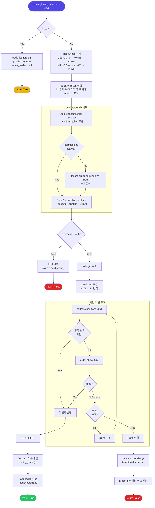
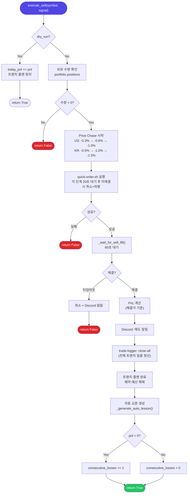
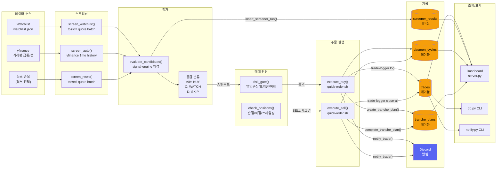
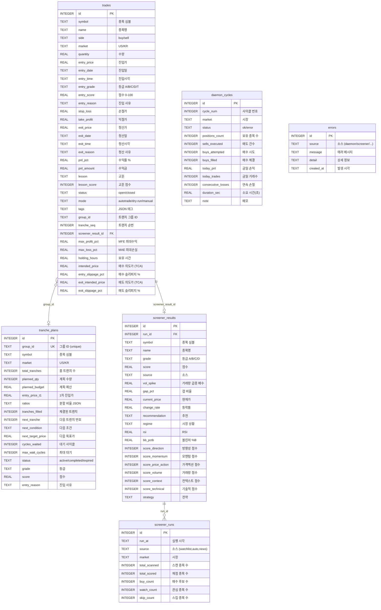

# toss-trading-system Architecture Diagrams

## 1. System Architecture (시스템 아키텍처)

```mermaid
graph TB
    subgraph CLI["tossctl CLI"]
        TOSS_BIN["tossctl<br/>(토스증권 API)"]
    end

    subgraph Core["Core Engine"]
        DAEMON["autotrade-daemon.py<br/>자동매매 데몬"]
        SIGNAL["signal-engine.py<br/>시그널 엔진"]
        SCREENER["stock-screener.py<br/>종목 스크리너"]
        TECH["technical-indicators.py<br/>기술적 지표"]
    end

    subgraph Execution["Order Execution"]
        QUICK["quick-order.sh<br/>preview→grant→place"]
    end

    subgraph Recording["Recording & Notification"]
        LOGGER["trade-logger.py<br/>거래 기록"]
        NOTIFY["notify.py<br/>Discord 알림"]
        REPORT["report-generator.py<br/>보고서 생성"]
        ANALYZER["trade-analyzer.py<br/>거래 분석/학습"]
    end

    subgraph Storage["Data Storage"]
        DB[("SQLite DB<br/>trading.db")]
        JSON["trade-log.json<br/>(백업)"]
        STATE["daemon-state.json<br/>(상태)"]
        CONFIG["signal-config.json<br/>(설정)"]
        WATCHLIST["watchlist.json<br/>(관심종목)"]
        PROTECTED["protected-stocks.json<br/>(보호종목)"]
    end

    subgraph External["External"]
        DISCORD["Discord<br/>Webhook"]
        YFINANCE["yfinance<br/>(시세 데이터)"]
        TOSS_API["토스증권 API<br/>(주문/시세/계좌)"]
    end

    subgraph Dashboard["Dashboard"]
        SERVER["server.py<br/>HTTP API :8777"]
        WEB["index.html<br/>프론트엔드"]
    end

    %% Daemon orchestrates everything
    DAEMON -->|"evaluate_buy()"| SIGNAL
    DAEMON -->|"check_positions()"| SIGNAL
    DAEMON -->|"risk_gate()"| SIGNAL
    DAEMON -->|"find_buy_candidates()"| SCREENER
    DAEMON -->|"execute_buy/sell()"| QUICK
    DAEMON -->|"_log_trade()"| LOGGER
    DAEMON -->|"_notify()"| NOTIFY
    DAEMON -->|"insert_cycle()"| DB
    DAEMON -->|"상태 저장"| STATE
    DAEMON -->|"설정 로드"| CONFIG
    DAEMON -->|"보호종목 로드"| PROTECTED

    %% Screener data flow
    SCREENER -->|"screen_auto()"| YFINANCE
    SCREENER -->|"screen_watchlist()"| TOSS_BIN
    SCREENER -->|"evaluate_candidates()"| SIGNAL
    SCREENER -->|"insert_screener_run()"| DB
    SCREENER -->|"watchlist 로드"| WATCHLIST

    %% Signal engine
    SIGNAL -->|"compute_alphas()"| SIGNAL
    SIGNAL -->|"query_open_entry_grades()"| DB
    SIGNAL -->|"get_active_tranche_plans()"| DB

    %% Order execution
    QUICK -->|"preview/grant/place"| TOSS_BIN
    TOSS_BIN -->|"REST API"| TOSS_API

    %% Recording
    LOGGER -->|"insert_trade()"| DB
    LOGGER -->|"JSON 백업"| JSON
    NOTIFY -->|"Webhook POST"| DISCORD

    %% Dashboard
    SERVER -->|"DB 조회"| DB
    SERVER -->|"tossctl 실행"| TOSS_BIN
    SERVER -->|"signal-engine 호출"| SIGNAL
    SERVER -->|"screener 호출"| SCREENER
    SERVER --> WEB

    %% Auto-learning
    DAEMON -.->|"매 20사이클"| ANALYZER
    ANALYZER -->|"거래 데이터 분석"| DB

    %% Styling
    style DAEMON fill:#4f46e5,color:#fff
    style DB fill:#f59e0b,color:#000
    style DISCORD fill:#5865f2,color:#fff
    style TOSS_API fill:#1e40af,color:#fff
    style QUICK fill:#dc2626,color:#fff
```

---

## 2. Daemon Cycle Flow (데몬 사이클 흐름)

```mermaid
flowchart TD
    START(["run_cycle() 시작"]) --> INC["cycle_count += 1"]
    INC --> S1{"1. 세션 체크<br/>check_session()"}

    S1 -->|"만료"| S1_FAIL["status = PAUSED_SESSION<br/>Discord: 세션 만료 알림"]
    S1_FAIL --> RETURN_F([return False])

    S1 -->|"정상"| S1_RESTORE{"이전 상태가<br/>PAUSED_SESSION?"}
    S1_RESTORE -->|"Yes"| S1_NOTIFY["Discord: 세션 복원 알림"]
    S1_RESTORE -->|"No"| S2
    S1_NOTIFY --> S2

    S2{"2. 점검 체크<br/>check_maintenance()"}
    S2 -->|"점검 중"| S2_FAIL["status = PAUSED_MAINTENANCE<br/>Discord: 점검 대기 알림"]
    S2_FAIL --> RETURN_F

    S2 -->|"정상"| S3{"3. 장 시간 체크<br/>is_market_open()"}
    S3 -->|"휴장"| SKIP_CLOSED(["return True<br/>(스킵)"])
    S3 -->|"개장"| S4

    S4["4. 데이터 조회<br/>account summary + positions"]
    S4 --> S4_LOSS{"일일 손실 한도<br/>today_pnl <= limit?"}
    S4_LOSS -->|"한도 초과"| S4_FAIL["status = PAUSED_LOSS_LIMIT<br/>Discord: 손실 한도 알림"]
    S4_FAIL --> RETURN_F

    S4_LOSS -->|"정상"| S4_MDD{"4.5 주간 MDD<br/>최근 7일 MDD <= limit?"}
    S4_MDD -->|"한도 초과"| S4_MDD_FAIL["status = PAUSED_MDD<br/>Discord: MDD 알림"]
    S4_MDD_FAIL --> RETURN_F

    S4_MDD -->|"정상"| S5{"5. 연속 손절 냉각<br/>consecutive_losses >= N?"}
    S5 -->|"냉각 필요"| S5_COOL["status = PAUSED_COOLDOWN<br/>sleep(cooldown_minutes)<br/>consecutive_losses = 0"]
    S5_COOL --> S6
    S5 -->|"정상"| S6

    S6["6. 보유 포지션 모니터링<br/>monitor_positions()"]
    S6 --> S6_MFE["6.1 MFE/MAE 갱신<br/>update_trade_mfe_mae()"]
    S6_MFE --> S6_SELL{"매도 시그널<br/>있는가?"}

    S6_SELL -->|"Yes"| S6_PROT{"보호종목?"}
    S6_PROT -->|"Yes"| S6_SKIP["매도 스킵"]
    S6_PROT -->|"No"| S6_EXEC["notify signal → execute_sell()"]
    S6_SKIP --> S7
    S6_EXEC --> S7
    S6_SELL -->|"No"| S7

    S7{"7. 리스크 게이트<br/>check_risk_gate()"}
    S7 -->|"미통과"| S7_SKIP(["신규 매수 스킵<br/>return True"])

    S7 -->|"통과"| S7_5{"7.5 분할매수<br/>트랜치 처리<br/>scaled_entry?"}
    S7_5 -->|"활성"| S7_5_PROC["process_pending_tranches()"]
    S7_5 -->|"비활성"| S8
    S7_5_PROC --> S8

    S8{"8. 매수 후보 탐색<br/>find_buy_candidates()"}
    S8 --> S8_SCAN{"풀 스캔 필요?<br/>last_scan >= 1시간?"}
    S8_SCAN -->|"Yes"| S8_FULL["풀 스크리닝<br/>stock-screener.py scan<br/>(yfinance 데이터 수집)"]
    S8_FULL --> S8_CACHE["후보 캐시 저장<br/>state.cached_candidates"]
    S8_CACHE --> S8_RESCORE
    S8_SCAN -->|"No"| S8_RESCORE["캐시된 후보 재채점<br/>technical-indicators.py<br/>(현재가/지표 갱신)"]
    S8_RESCORE --> S8_CHECK{"후보 있는가?"}
    S8_CHECK -->|"없음"| S8_NONE(["return True"])
    S8_CHECK -->|"있음"| S8_NOTIFY["Discord: 스캔 결과 알림"]

    S8_NOTIFY --> S9["9. 매수 실행 루프<br/>시장별 슬롯 확인"]
    S9 --> S9_LOOP{"후보 순회"}
    S9_LOOP -->|"각 후보"| S9_FILTER{"보호종목?<br/>이미 보유?<br/>트랜치 활성?<br/>슬롯 잔여?"}
    S9_FILTER -->|"스킵"| S9_LOOP
    S9_FILTER -->|"매수 가능"| S9_BUY["execute_buy()<br/>+ 트랜치 플랜 생성"]
    S9_BUY --> S9_LOOP
    S9_LOOP -->|"완료"| S10

    S10["10. 사이클 DB 기록<br/>insert_cycle()"]
    S10 --> S11{"매 20사이클?"}
    S11 -->|"Yes"| S11_LEARN["자동 학습<br/>_auto_learn()"]
    S11 -->|"No"| RETURN_T
    S11_LEARN --> RETURN_T(["return True"])

    style START fill:#4f46e5,color:#fff
    style RETURN_F fill:#dc2626,color:#fff
    style RETURN_T fill:#22c55e,color:#fff
    style SKIP_CLOSED fill:#6b7280,color:#fff
    style S7_SKIP fill:#6b7280,color:#fff
    style S8_NONE fill:#6b7280,color:#fff
```

---

## 3. Order Execution Flow (주문 실행 흐름)

### 3a. execute_buy() 흐름

### 3b. execute_sell() 흐름

---

## 4. Data Flow (데이터 흐름)

---

## 5. DB Schema (데이터베이스 스키마)

---

## Component Summary (컴포넌트 요약)

| 컴포넌트 | 파일 | 역할 |
|----------|------|------|
| **데몬** | `autotrade-daemon.py` | 메인 루프. 사이클 반복하며 전체 매매 오케스트레이션 |
| **시그널 엔진** | `signal-engine.py` | 매수 평가(0-100점), 손절/익절 체크, 리스크 게이트, Kelly Criterion |
| **스크리너** | `stock-screener.py` | 워치리스트 + yfinance 자동 스크리닝 + 뉴스 종목 통합 채점 |
| **주문 실행** | `quick-order.sh` | tossctl preview -> grant -> place 원샷 실행 |
| **거래 기록** | `trade-logger.py` | DB + JSON 이중 기록 (open/close/close-all/lesson) |
| **알림** | `notify.py` | Discord Webhook (거래/시그널/에러/세션/데몬/보고서) |
| **대시보드** | `dashboard/server.py` | HTTP API 서버 + 프론트엔드 (포트 8777) |
| **성과 지표** | `performance-metrics.py` | Sharpe, Sortino, MDD, Equity Curve (서킷 브레이커/대시보드) |
| **사이징 (Vol Target)** | `_vol_targeted_invest()` in daemon | ATR 기반 변동성 타겟팅 (risk parity). `vol_target_enabled` 설정으로 토글 |
| **DB** | `db.py` | SQLite 관리 (trades, screener, cycles, errors, tranche_plans) |
| **분석** | `trade-analyzer.py` | 거래 데이터 분석, 파라미터 자동 조정 제안 |
