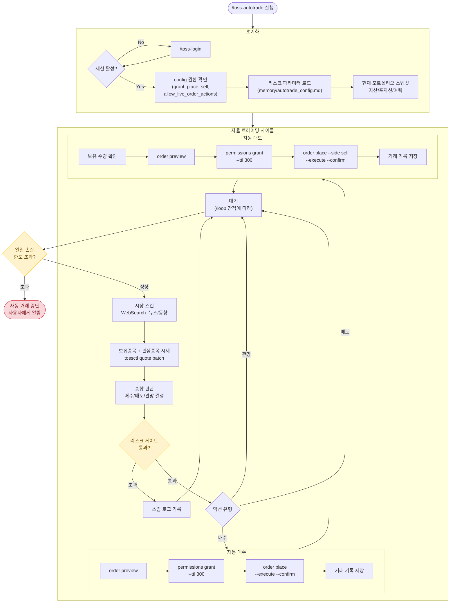

# toss-autotrade: 자율 트레이딩 모드

사용자 확인 없이 Claude가 독립적으로 분석 → 판단 → 주문 → 관리 → 복기를 수행합니다.

**이 모드는 실제 돈이 오가는 자동매매입니다. 활성화 전 반드시 리스크 한도를 확인하세요.**

## 환경변수

```bash
export PATH="/Users/aiden-kwak/Desktop/Personal/Stock/tossinvest-cli/bin:$PATH"
export TOSSCTL_AUTH_HELPER_DIR="/Users/aiden-kwak/Desktop/Personal/Stock/tossinvest-cli/auth-helper"
export TOSSCTL_AUTH_HELPER_PYTHON="/Users/aiden-kwak/Desktop/Personal/Stock/tossinvest-cli/auth-helper/.venv/bin/python3"
```

## 전체 플로우



## 사전 조건 (첫 실행 시)

### 1. config.json 거래 권한 활성화

자동매매를 위해 필요한 최소 config:

```json
{
  "trading": {
    "grant": true,
    "place": true,
    "sell": true,
    "kr": true,
    "fractional": true,
    "cancel": true,
    "allow_live_order_actions": true,
    "dangerous_automation": {
      "accept_fx_consent": true
    }
  }
}
```

config 파일 경로: `~/Library/Application Support/tossctl/config.json`

첫 실행 시 현재 config를 확인하고, 필요한 권한이 없으면 사용자에게 한번만 확인:
> "자율 트레이딩을 위해 config에서 거래 권한을 활성화합니다. 진행할까요?"

이후에는 확인 없이 자동 실행합니다.

### 2. 리스크 파라미터 설정

첫 실행 시 사용자에게 리스크 파라미터를 물어보고 저장합니다:

```markdown
# memory/autotrade_config.md
- 1회 최대 투자: 총 자산의 N% (기본: 10%)
- 손절선: 진입가 대비 -N% (기본: -3%)
- 익절선: 진입가 대비 +N% (기본: +7%)
- 일일 최대 손실: 총 자산의 -N% (기본: -2%)
- 동시 포지션: 최대 N종목 (기본: 2)
- 대상 시장: us / kr / both (기본: both)
- 감시 간격: N분 (기본: 5)
```

설정이 이미 있으면 로드하고, 없으면 기본값으로 생성.

## 자율 판단 기준

### 매수 시그널 (모두 충족 시)

1. **시장 환경**: 리스크온 분위기 (급락장이 아닌 경우)
2. **종목 조건**:
   - 거래량이 평소 대비 증가
   - 뉴스/이벤트 기반 모멘텀 존재
   - 기술적으로 지지선 근처 또는 브레이크아웃 구간
3. **포트폴리오 조건**:
   - 동시 포지션 한도 미달
   - 일일 손실 한도 미달
   - 투자 여력(주문 가능 금액) 충분

### 매도 시그널 (하나라도 충족 시)

1. **손절**: 현재가가 진입가 대비 손절선 이하
2. **익절**: 현재가가 진입가 대비 목표가 이상
3. **모멘텀 소멸**: 매수 근거가 무효화됨
4. **리스크 회피**: 시장 급변 시 포지션 축소

### 관망 조건

1. 명확한 시그널 없음
2. 시장 불확실성 높음
3. 포지션 한도 도달
4. 일일 손실 한도 근접

## 속도 최적화 실행 순서

단타에서는 판단 후 즉시 실행이 핵심입니다. 아래 원칙을 반드시 따르세요:

### 원칙 1: 병렬 데이터 수집

데이터 수집은 **반드시 병렬 Bash 호출**로 실행합니다. 독립적인 명령은 절대 순차 실행하지 마세요.

```
[병렬 실행 - 동시에 3개 Bash 호출]
├── Bash 1: tossctl portfolio positions --output json
├── Bash 2: tossctl account summary --output json  
└── Bash 3: tossctl quote batch <보유종목> <관심종목> --output json

→ 3개 결과를 한번에 받아서 즉시 판단
```

### 원칙 2: 사전 권한 부여

세션 시작 시 한번만 grant하고 이후 주문에서는 생략합니다:

```bash
# 세션 시작 시 1회만 실행 (TTL 1시간)
tossctl order permissions grant --ttl 3600
```

### 원칙 3: 원샷 주문 스크립트

preview → grant 체크 → place를 **하나의 스크립트**로 묶어 Bash 1회 호출로 실행합니다:

```bash
# 원샷 주문 (preview + grant확인 + place를 한번에)
bash /Users/aiden-kwak/Desktop/Personal/Stock/toss-trading-system/scripts/quick-order.sh \
  --symbol TSLA --side buy --qty 1 --price 25000
```

### 원칙 4: 사이클 분리 (빠른 감시 vs 깊은 분석)

**빠른 감시 사이클 (매 2-5분, 최소 도구 호출)**:
```
[병렬] portfolio + quote batch → 손절/익절 체크 → 해당 시 즉시 원샷 주문
```
도구 호출: 2-3회, 소요: ~5초

**깊은 분석 사이클 (매 15-30분)**:
```
[병렬] WebSearch(뉴스) + portfolio + quote → 종합 판단 → 매수 기회 탐색
```
도구 호출: 3-5회, 소요: ~10초

매 사이클마다 뉴스를 검색하지 않습니다. 빠른 감시가 기본이고, N번째 사이클마다 깊은 분석을 합니다.

### 원칙 5: 판단은 한번에

데이터를 모두 수집한 뒤 **한번의 추론**으로 모든 포지션에 대한 결정을 내립니다.
종목별로 순차 판단하지 마세요.

### 매 사이클 실행 순서 (최적화)

```
[빠른 감시 사이클]
1. 병렬 Bash 3개: positions + summary + quote batch   (~2초)
2. 한번에 판단: 손절/익절 체크 + 기회 탐색            (~1초, effort: low)
3. 액션 필요 시: 원샷 주문 스크립트                    (~3초)
4. 거래 발생 시: memory 기록                           (~1초)
────────────────────────────────────────────────
합계: ~4초(관망) / ~7초(주문 실행)
```

### 주문 실행 (원샷 스크립트)

```bash
# quick-order.sh가 preview→grant확인→place를 한번에 처리
bash /Users/aiden-kwak/Desktop/Personal/Stock/toss-trading-system/scripts/quick-order.sh \
  --symbol <SYM> --side <buy|sell> --qty <N> --price <P> --output json
```

이 스크립트가 내부적으로:
1. `tossctl order preview` → confirm_token 추출
2. `tossctl order permissions status` → 활성이면 skip, 아니면 grant
3. `tossctl order place --execute --confirm <token>` → 실행
를 순차적으로 처리합니다.

## /loop 연동

자율 트레이딩은 `/loop`과 함께 사용합니다:

```
/loop 5m /toss-autotrade
```

이렇게 하면 5분마다 자동으로 사이클이 실행됩니다.

또는 자율 페이싱 (Claude가 시장 상황에 따라 간격 조절):

```
/loop /toss-autotrade
```

- 장중 활발할 때: 2-3분 간격
- 장중 조용할 때: 10분 간격
- 장 외 시간: 30분 간격

## 자동 중단 조건

다음 상황에서 자동으로 거래를 중단하고 사용자에게 알립니다:

1. **일일 손실 한도 초과**: 당일 실현+평가 손실이 한도 초과
2. **세션 만료**: tossctl 세션이 만료됨
3. **연속 손절 3회**: 연속 3번 손절 시 냉각기
4. **API 오류**: tossctl 명령 실패 시
5. **장 종료**: 거래 시간 외

## 거래 기록 (자동)

모든 거래는 자동으로 memory에 기록됩니다:

파일: `memory/trades/YYYYMMDD_<symbol>_auto_<buy|sell>.md`

```markdown
---
name: autotrade-YYYYMMDD-SYMBOL
description: 자동매매 기록
type: project
---
- 모드: 자율(autotrade)
- 종목: SYMBOL
- 방향: buy/sell
- 수량: N주
- 가격: $XXX
- 시각: HH:MM
- 판단 근거: (Claude의 분석 요약)
- 시장 상황: (뉴스/환경 요약)
```

## 일일 리포트

장 종료 후 또는 자동 중단 시, 당일 거래 요약을 생성합니다:

```
[자율 트레이딩 일일 리포트]
날짜: 2026-04-11
총 거래: N건 (매수 N, 매도 N)
실현 손익: +/-XXX원
평가 손익: +/-XXX원
승률: N/M (XX%)
최고 수익 거래: SYMBOL (+N%)
최대 손실 거래: SYMBOL (-N%)
교훈: (패턴 분석)
```

## 주의사항

- **이 모드는 실제 자동매매입니다. 손실이 발생할 수 있습니다.**
- 리스크 파라미터를 보수적으로 설정하세요
- 처음에는 소액으로 시스템을 검증하세요
- Claude의 판단은 항상 틀릴 수 있습니다
- 시스템 오류로 예상치 못한 주문이 실행될 수 있습니다
- 모든 책임은 사용자에게 있습니다
