# toss-daytrade: 토스증권 단타 트레이딩 시스템

분석 → 종목발굴 → 감시 → 주문 → 복기를 하나의 워크플로우로 통합합니다.

## 환경변수

```bash
export PATH="/Users/aiden-kwak/Desktop/Personal/Stock/tossinvest-cli/bin:$PATH"
export TOSSCTL_AUTH_HELPER_DIR="/Users/aiden-kwak/Desktop/Personal/Stock/tossinvest-cli/auth-helper"
export TOSSCTL_AUTH_HELPER_PYTHON="/Users/aiden-kwak/Desktop/Personal/Stock/tossinvest-cli/auth-helper/.venv/bin/python3"
```

## 사전 조건

1. `tossctl auth status`로 세션 확인 (없으면 `/toss-login` 안내)
2. 거래 시 config.json 권한 확인 (`tossctl config show`)

## 전체 플로우

```mermaid
flowchart TD
    START(["/toss-daytrade 실행"]) --> AUTH{"세션 활성?"}
    AUTH -- No --> LOGIN["/toss-login\n(QR 로그인)"]
    LOGIN --> AUTH
    AUTH -- Yes --> P1

    subgraph P1["Phase 1: 장전 분석"]
        direction TB
        NEWS["시장 뉴스 수집\n(WebSearch)"] --> POSITIONS["보유 포지션 확인\n(tossctl portfolio)"]
        POSITIONS --> QUOTES["보유종목 시세\n(tossctl quote batch)"]
        QUOTES --> BRIEFING["오늘의 브리핑\n시장분위기 / 섹터 / 전략"]
    end

    P1 --> P2

    subgraph P2["Phase 2: 종목 발굴"]
        direction TB
        US_SCAN["미국: 프리마켓/갭\n거래량 급증 탐색"] --> KR_SCAN["한국: 테마/이슈\n등락률 상위 탐색"]
        KR_SCAN --> WATCHLIST["관심 종목 리스트\n(tossctl quote batch)"]
    end

    P2 --> P3

    subgraph P3["Phase 3: 진입 판단"]
        direction TB
        TECH["기술적 분석\n가격/거래량/추세"] --> SIZING["포지션 사이징\n(총자산 20% 이내)"]
        SIZING --> SIGNAL["매수/매도 시그널\n종목, 가격, 수량, 손절선"]
    end

    P3 --> DECIDE{"사용자 판단"}
    DECIDE -- "관망" --> P2
    DECIDE -- "진행" --> P4

    subgraph P4["Phase 4: 주문 실행"]
        direction TB
        CONFIG["config 권한 확인"] --> PREVIEW["order preview\n(미리보기 + 토큰)"]
        PREVIEW --> CONFIRM{"사용자 최종 확인?"}
        CONFIRM -- No --> CANCEL["주문 취소"]
        CONFIRM -- Yes --> GRANT["permissions grant\n(TTL 300초)"]
        GRANT --> EXECUTE["order place --execute\n--confirm token"]
    end

    P4 --> P5

    subgraph P5["Phase 5: 포지션 관리"]
        direction TB
        MONITOR["시세 주기적 체크\n(tossctl quote get)"] --> SL_TP{"손절/익절\n도달?"}
        SL_TP -- No --> MONITOR
        SL_TP -- Yes --> EXIT["청산 주문 실행"]
    end

    P5 --> P6

    subgraph P6["Phase 6: 거래 복기"]
        direction TB
        RECORD["거래 기록 저장\n(memory/trades/)"] --> EVAL["결과 평가\n수익/손실, 점수"]
        EVAL --> LESSON["교훈 추출\n다음 거래에 반영"]
    end

    P6 --> END(["세션 종료 or 다음 거래"])
    END -. "다음 종목" .-> P2

    subgraph RISK["리스크 게이트 (항시 적용)"]
        direction LR
        R1["1회 투자\n≤ 자산 20%"]
        R2["손절선\n-3~5%"]
        R3["일일 손실\n≤ -3%"]
        R4["동시 포지션\n≤ 3종목"]
    end

    style P1 fill:#cfe2ff,stroke:#6ea8fe,color:#084298
    style P2 fill:#d1e7dd,stroke:#6edaa0,color:#0f5132
    style P3 fill:#fff3cd,stroke:#ffc107,color:#664d03
    style P4 fill:#f8d7da,stroke:#ea868f,color:#842029
    style P5 fill:#e2d9f3,stroke:#a98eda,color:#432874
    style P6 fill:#d1ecf1,stroke:#6edff6,color:#055160
    style RISK fill:#f8d7da,stroke:#dc3545,color:#842029
    style DECIDE fill:#fff3cd,stroke:#ffc107,color:#664d03
    style CONFIRM fill:#fff3cd,stroke:#ffc107,color:#664d03
```



## 단타 워크플로우 상세

### Phase 1: 장전 분석 (시장 환경 파악)

사용자가 단타를 시작하면 아래 순서로 시장 환경을 분석합니다:

1. **시장 뉴스 분석** - WebSearch로 최근 시장 뉴스, 선물/야간 동향 파악
2. **보유 포지션 확인** - `tossctl portfolio positions --output json`
3. **보유종목 시세** - `tossctl quote batch <보유종목들> --output json`

분석 결과를 종합하여 오늘의 트레이딩 방향을 제시:
- 시장 분위기 (리스크온/오프)
- 주목할 섹터/테마
- 보유종목 현황 및 대응 전략
- 오늘의 관심 종목 리스트

### Phase 2: 종목 발굴 및 감시

**미국주식:**
- WebSearch로 프리마켓/애프터마켓 움직임 확인
- 거래량 급증 종목, 갭업/갭다운 종목 탐색
- 실적 발표 예정 종목 확인

**한국주식:**
- WebSearch로 당일 테마/이슈 종목 확인
- 거래량 상위, 등락률 상위 종목 탐색

발굴된 종목은 `tossctl quote batch`로 실시간 시세 확인.

### Phase 3: 진입 판단

종목이 정해지면 다음을 분석합니다:

1. **시세 조회**: `tossctl quote get <symbol> --output json`
2. **기술적 분석**: 가격 수준, 거래량, 추세 판단
3. **포지션 사이징**: 총 자산 대비 적절한 투자 비중 계산
   - 1회 투자: 총 자산의 최대 20%
   - 손절선: 진입가 대비 -3% ~ -5%
   - 목표가: 진입가 대비 +5% ~ +10%

판단 결과를 사용자에게 제시:
```
[매수 시그널]
종목: PLTR (팔란티어)
현재가: $128.06
판단: 매수 / 관망 / 매도
근거: (분석 내용)
제안 수량: N주
제안 가격: $XXX (지정가)
손절선: $XXX (-N%)
목표가: $XXX (+N%)
```

### Phase 4: 주문 실행

**반드시 사용자 확인 후 실행합니다.**

1. config 권한 확인 및 필요시 활성화 (사용자 동의 하에)
2. `tossctl order preview` 로 미리보기
3. 사용자에게 주문 내용 확인
4. `tossctl order permissions grant --ttl 300`
5. `tossctl order place ... --execute --dangerously-skip-permissions --confirm <token>`

### Phase 5: 포지션 관리

진입 후 감시 모드:
- 주기적으로 `tossctl quote get <symbol>`로 시세 확인
- 손절선/목표가 도달 여부 체크
- 미체결 주문 확인: `tossctl orders list --output json`

### Phase 6: 거래 복기

거래 완료 후 memory에 기록합니다:

```
파일: memory/trade_log_YYYYMMDD_<symbol>.md
내용:
- 종목, 매수/매도가, 수량
- 수익/손실 금액 및 비율
- 진입 근거가 맞았는지
- 교훈 (다음에 적용할 것)
- 점수 (1-10)
```

## 리스크 관리 규칙

이 규칙을 절대 위반하지 마세요:

1. **1회 최대 투자**: 총 자산의 20% 이하
2. **손절선 필수**: 모든 포지션에 손절선 설정
3. **일일 최대 손실**: 총 자산의 -3% 도달 시 당일 거래 중단
4. **동시 포지션**: 최대 3종목
5. **preview 필수**: 주문 전 반드시 preview 실행
6. **사용자 확인 필수**: 모든 주문은 사용자 동의 후 실행

## 감시 모드 (/loop 연동)

`/loop` 스킬과 연동하여 주기적 감시 가능:
- 보유 종목 시세 변동 체크
- 손절/익절 알림
- 관심 종목 가격 알림

## 거래 가능 시간

| 시장 | 거래 시간 (한국시간) |
|------|---------------------|
| 한국 (KOSPI/KOSDAQ) | 09:00 - 15:30 |
| 미국 (NYSE/NASDAQ) | 23:30 - 06:00 (서머타임: 22:30 - 05:00) |

## 주의사항

- 이 시스템은 투자 조언이 아닙니다
- AI의 판단은 항상 틀릴 수 있습니다
- 실제 손실이 발생할 수 있으며, 모든 책임은 사용자에게 있습니다
- 소액으로 시작하여 시스템을 검증한 후 규모를 늘리세요
